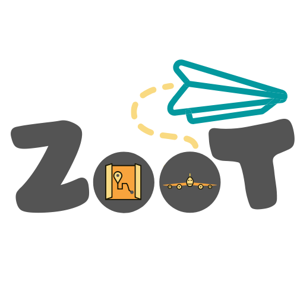

<a href="/">
	

	  
	

</a>

## ➤ Introduction

Zoot is here to help you plan your next adventure! From securing bookings and scoping out flights, to finding activities for your destination, Zoot has it all! You can also keep track of where you've been so you can revisit the unforgettable memories you've made.

## ➤ Technologies
* **React**
* **Typescript**
* **Apollo**
* **GraphQL**
* **MongoDB**
* **External APIs**
  * Google People API
  * Google Geocoding API
  * Stripe Payments API
  * 

## ➤ License

Licensed under [MIT](https://opensource.org/licenses/MIT).
